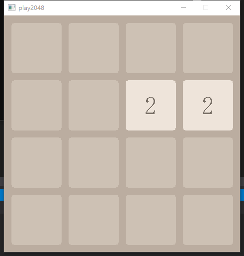
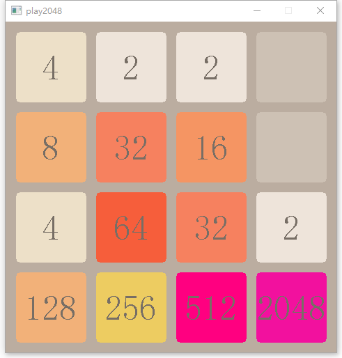

# 2048

# 基于Easyx图形库写的2048

## 2048界面

  - 初始化界面

  - 2048完成界面

## 程序使用

- 1.方向上下左右控制数字方块整体移动方向

- 2.相同数字则相加，达到2048为胜利，可以挑战超过2048。

- 3.未完成的功能

  -- 游戏分数记录

  -- 超过2048后的数字累加（增加颜色枚举的数量）

  -- 提供反悔功能

  -- 较少空操作的图形绘制
